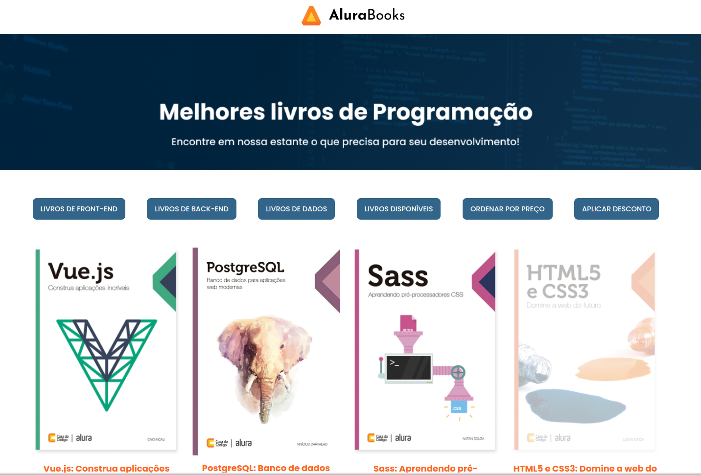

## Projeto 

Projeto alura-books do curso Alura javascript métodos de arrays

Projeto com funcionalidades extras de menu de filtros
criando um Toggle dos botões de cada filtro do Menu de Categorias

Pode-se combinar filtro de uma dessas categorias de livros:

- Front-End
- Back-End
- Dados
- Disponíveis

Combinado com 2 categorias especiais :

- ordenação por preço
- aplicação de desconto (pré-definido hardcoded de 30%)

Também somente a categoria "Disponíveis" possuí uma seção de somatório de valores de todos os livros disponíveis

  

Página inicial de apresentação de livros da , uma plataforma de compra de livros digitais.

## Tecnologias utilizadas durante o curso

- Javascript (filter, forEach, map, reduce, sort, fetch)
- DOM

## Tecnologias utilizadas no projeto

- HTML
- CSS

## Screenshots

